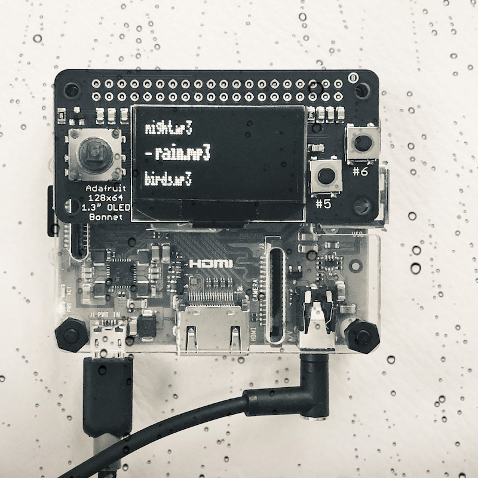

# slee.py

## Sleep sound player for Raspberry Pi

* [Raspberry Pi 3 A+](https://www.raspberrypi.org/products/raspberry-pi-3-model-a-plus/)
* [Adafruit 128x64 OLED Bonnet for Raspberry Pi](https://www.adafruit.com/product/3531)
* [VLC Player](https://www.videolan.org/vlc/download-ubuntu.html)

#### Up, Left: Previous
#### Down, Right: Next
#### 5: Pause
#### 6, Center: Play

